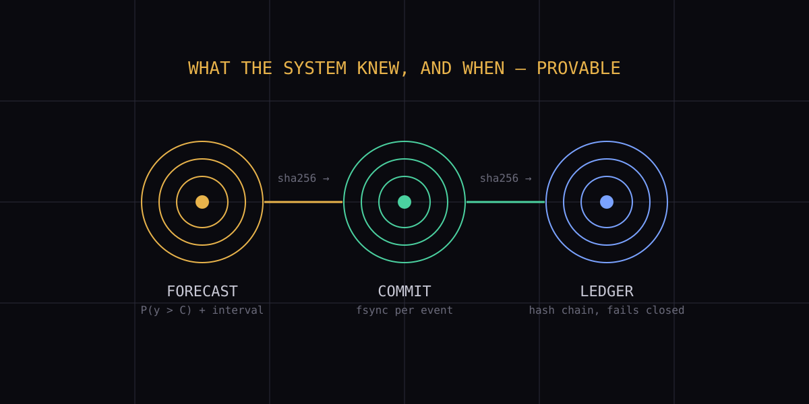

# Bear ColibrIA — Calibrated Exceedance Engine

**A forecasting engine that sells probability, not accuracy — and proves when
it knew.** Online causal mixtures with empirical uncertainty calibration, in a
durable runtime that commits every probability **before** the hour it predicts.
CPU-only, stdlib-only, no cloud, no API, no owner.

```
   Author:  F E R M I  ∞  H A R T  <contact@fermihart.com>
   License: BSD-3-Clause (see LICENSE)
    Status:  research/HOLD — prospective edge pending, no public beta.
   Release:  exceedance_product_v1.zip (26 files, SHA256 below).
```

> **What this is:** a small online system that predicts the next unpublished
> hour of an electricity load series and emits **P(load > contracted level)**
> into a hash-chained ledger before the target hour — with auditable proof the
> probability existed before the event. A frozen empirical residual CDF turns
> the strongest online expert into a calibrated exceedance probability; a
> two-commit protocol (immutable forecast, then a post-commit availability
> witness) makes issuance provable.
>
> **What this is not:** an LLM, a chatbot, a transformer, a cloud API, a
> black box, or an autonomous controller. It alerts; a human operator decides.
> It is not a production release: the measured edge is retrospective, and the
> contract levels in the bundle are synthetic research scenarios.

---

## Why probability instead of accuracy

The market sells point accuracy. Our evidence says the point flips sign when
the regime turns, while the calibrated uncertainty does not: across four
consumed regimes, interval coverage stayed near 89% (83.9–94.6%) as every
point forecast failed the same stability gate on the same day — the
transition-day failure, where every reactive mechanism arrives late. So we
stopped selling what flips and started selling what holds: **the calibrated
tail.** Where a transformer is a cannon for a mosquito — and misses without
warning — this is the mosquito that warns, with a stated probability.

---

## Proven today: the frozen evidence

All numbers below are retrospective on consumed data (one contiguous German
grid window: 720 train, 336 development, 336 reserved, frozen before every
run), except the mechanism row, which is live.

| Claim | Evidence |
|---|---|
| Exceedance beats climatology | Brier P75 **0.086 vs 0.183 (53% better)**; P90 **0.069 vs 0.098 (30% better)** |
| Alert cost beats climatology | 1620→**271** (P75), 740→**224** (P90) at the best frozen threshold (10·miss + 1·false-alarm) |
| Pre-event issuance works | Hash-chained ledger; one record per forecast hash; fsync per record; fails closed on tampering; crash-tested on both commit phases |
| Durable recovery | Exact reopen after real process kill post-fsync; p99 full cycle **605ms**; 128 durable cycles; snapshots bounded |
| Self-monitoring signal | Expert disagreement at issuance predicts the best-expert error (3/4 windows + live replication) — direction explicitly **not** claimed |
| Reproducibility | Deterministic bundle build (byte-identical twice); manifest-checked extraction; stdlib-only import verified |

What the evidence does **not** support is stated with the same weight:
the liquid core (CfC/SSC) stays out of the product (three registered
negatives; one notable partial at H3); disagreement-conditioned calibration
has no edge; risk blends are unqualified; no public beta is claimed. See
`STATUS.md`.

---

## Layout

```
README.md                  This page.
LICENSE                    BSD-3-Clause.
SPEC.md                    Normative spec: forecast, calibration, issuance.
STATUS.md                  Honest maturity matrix: proven / research / roadmap.
SECURITY.md                Threat model and private reporting.
CONTRIBUTING.md            Evidence-first contribution rules.
CHANGELOG.md               Release history.
RELEASING.md               Curation procedure (the anti-incident checklist).
ARTIFACTS.manifest         Release contents with SHA256.
SHA256SUMS                 Checksums of the release zip.
Makefile                   make verify — checksums, manifest, extract, smoke.
dist/exceedance_product_v1.zip
                           The product: 26 files (lck/ core, scripts/,
                           frozen CDF artifact, docs) + MANIFEST.json.
                           No datasets, credentials, binaries, or logs.
```

---

## Build & test

```sh
make verify   # checksums + manifest + extract + stdlib-only import + service smoke
```

`make verify` requires Python 3.12 on Linux. It unpacks the release zip in a
clean directory, checks every file against `MANIFEST.json`, proves the service
imports without numpy/torch/ncps, runs the exceedance service against an empty
ledger (appends 0, chain intact), and verifies the frozen CDF source hash. A
packaging mistake is invisible to every other check in this repo: the build can
be green, the tests green, and the artifact still unusable. Assert on behaviour.

---

## Run the product

From the extracted bundle directory (Linux, Python 3.12, stdlib only):

```sh
# Emit provable pre-event exceedance records from running observers:
python3 -B scripts/exceedance_service.py --ledger ./ledger.jsonl
```

The ledger accepts one record per `forecast_sha256`, fails closed on
corruption, and never rewrites the chain. Contract levels live in
`experiments/exceedance_cdf_v1.json` (`contract_levels_mw`) — **in the field,
replace them with the operator's real contracted demand; the bundled levels
are synthetic scenarios from the consumed window.**

---

## The contract in 6 lines

1. The observer issues a forecast for a future hour end (all inputs past-only).
2. Preparation commits the immutable forecast payload (SQLite WAL/FULL, one writer).
3. The clock is sampled **after** that commit; if the lead-time deadline still
   holds, the availability witness is committed, linked to the payload hash.
4. The exceedance service (read-only over the observer) computes P(load > C)
   from the frozen residual CDF and appends one ledger record per forecast hash.
5. Every record carries the CDF source hash; a changed source fails the build.
6. A crash between the two commits cannot be retroactively credited after the
   deadline; a confirmed record survives a crash after confirmation.

---

## Status & honesty

This project states plainly what is exercised vs. what is structure-only. See
**[STATUS.md](STATUS.md)** for the maturity matrix (retrospective edge: yes;
prospective edge: pending; beta: HOLD; participants needed: a second human
rater, an operator with a real contract, real weeks of accumulation). Trust is
the product.

— F E R M I ∞ H A R T

## License and author

Original source is released under [`BSD-3-Clause`](LICENSE). The code license
does not grant trademark or endorsement rights.

**F E R M I ∞ H A R T**
<contact@fermihart.com>
